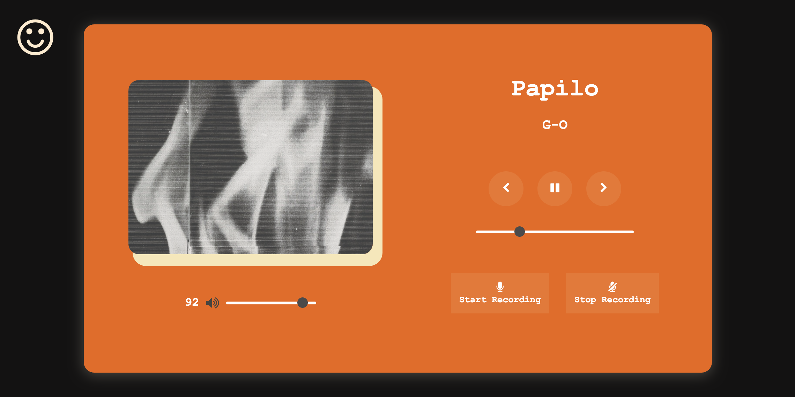

## Visual Audio Project - Music Player
The project was to build an audio player by using HTML, CSS, and Javascript. In this project, with 2 functionalities to let audience to simply play musics and record their song for practice while singing.

#### Technologies
* HTML 5
* CSS 3 
* JavaScript

#### Tools
* Visual Studio Code
* Version Control
* GitHub

#### Functionalities
* Play music (play, pause, previous, next, volume conrol, mute voice)
* Audio recording (recording - 'start recording'; stop & playback - 'stop recording')

#### Overview

